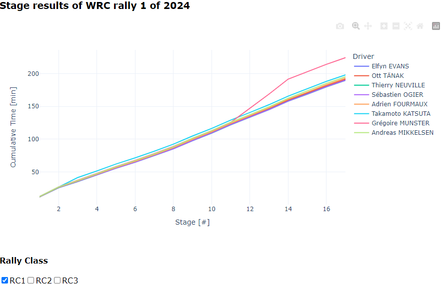

## Interactive visualization of WRC rally results

This repository allows for fetching of WRC rally results via a public API and displays the cumulative time delta of all participating drivers depending on their car class using an interactive plotly dash app. 

#### Example:

